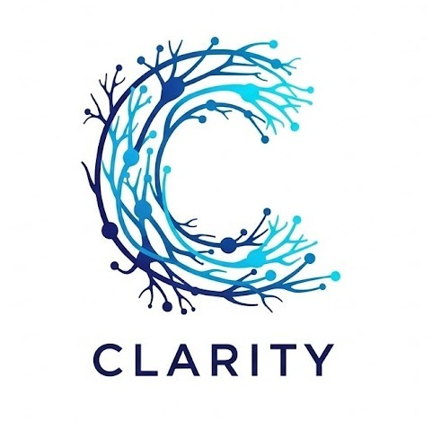
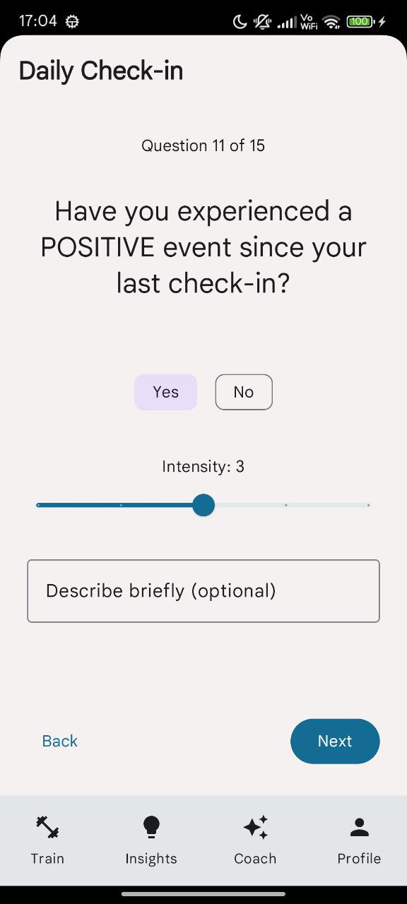
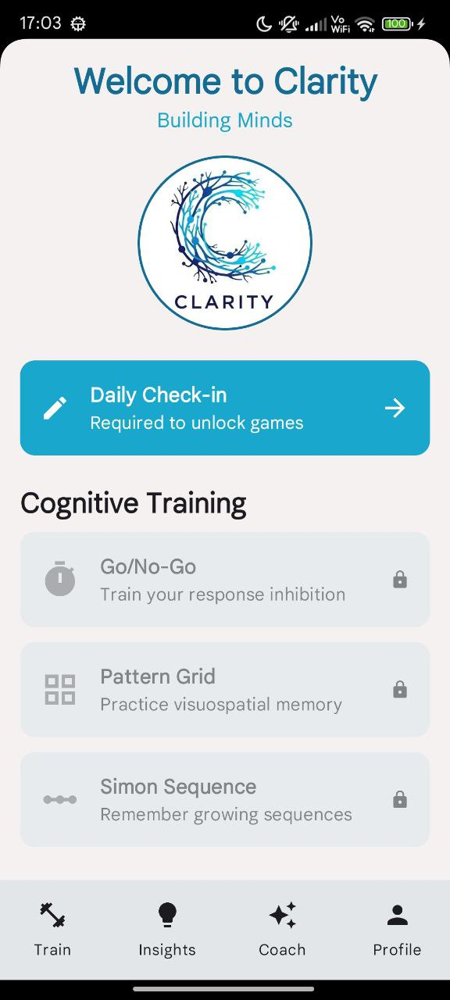
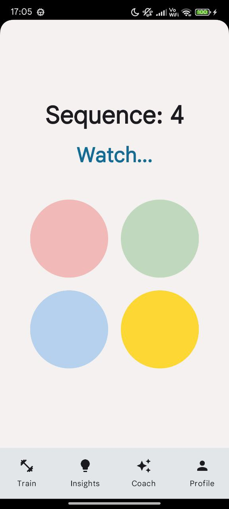
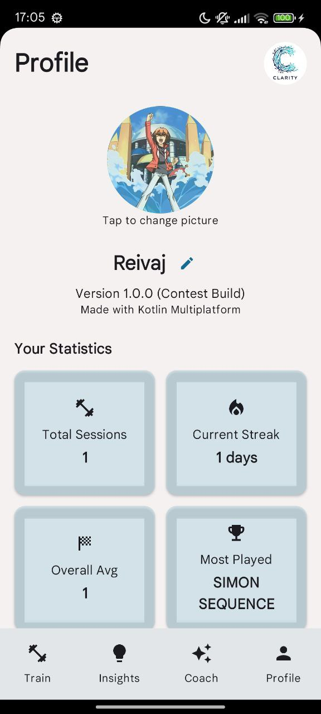
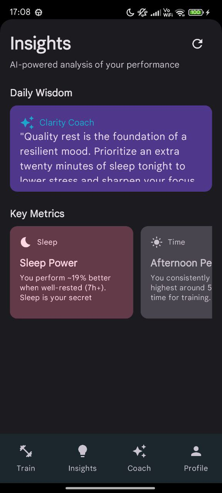
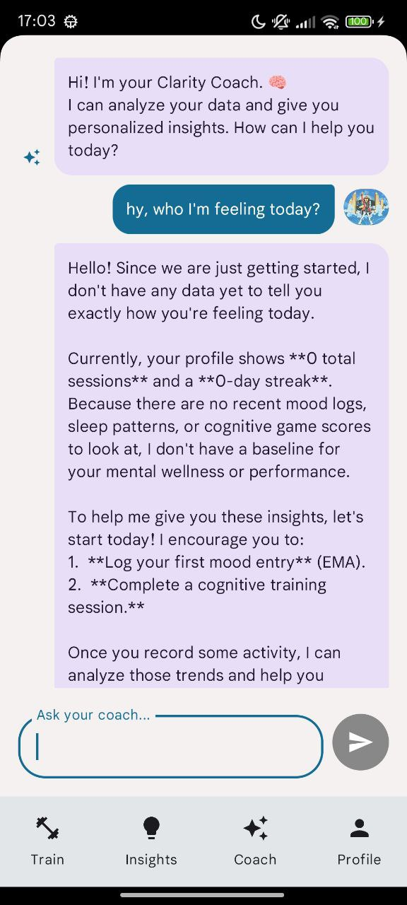
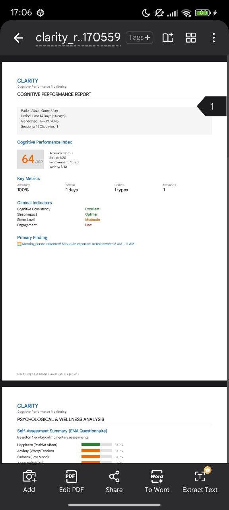

# Clarity
<div align="center">
  
  <br />
  <br />

  [](https://kotlinlang.org/docs/multiplatform.html)
  
  
  
</div>

<div align="center">
  <h3>A Cognitive Training & Self-Awareness App</h3>
  <p>Built with 100% Shared Kotlin Logic and UI</p>
  <a href="https://drive.google.com/file/d/1bCp93Ah38DabCwwGZEiU3_fdF3qFaBBP/view?usp=drive_link">🎥 Watch the 3-min Screencast</a>
</div>

<br />

## 📸 Screenshots

| **Daily Check-in** | **Train Screen** | **Cognitive Game** |
|:---:|:---:|:---:|
|  |  |  |

| **Profile Stats** | **Personalized Insights** | **AI Coach Chat** |
|:---:|:---:|:---:|
|  |  |  |

<div align="center">
  <b>Professional PDF Export</b><br />
  
</div>

<br />

**Clarity** is a cognitive training app built with **Kotlin Multiplatform** that uses **Ecological Momentary Assessment (EMA)** to analyze how your daily lifestyle affects your brain performance.

Built for the [Kotlin Student Coding Competition 2026](https://kotlinlang.org/contest/).

---

## 🎥 Video Demo

> [!NOTE]
> **[Watch the 3-minute Screencast here](https://drive.google.com/file/d/1bCp93Ah38DabCwwGZEiU3_fdF3qFaBBP/view?usp=drive_link)**
> *Demonstrating functionalities on Android & iOS*

---

## 🚀 How to Run

### Prerequisites
*   **Android Studio** (Ladybug or newer recommended) with KMP plugin.
*   **Xcode** (15.0+) for iOS target.
*   **JDK 17**.

### 🤖 Android
1.  Open the project in **Android Studio**.
2.  Sync Gradle.
3.  Select `composeApp` (or `androidApp`) configuration.
4.  Run on an Emulator or Device.

*Command Line:*
```bash
./gradlew :composeApp:installDebug
```

### 🍎 iOS
1.  Navigate to `iosApp` folder: `cd iosApp`.
2.  Open `iosApp.xcworkspace` in **Xcode**.
3.  Ensure your Signing Team is selected in project settings.
4.  Run on an iPhone Simulator or Device.

*Note: The project uses CocoaPods. If you face issues, run `pod install` in the `iosApp` directory.*

---

## 🧪 Judge's Walkthrough

Follow this flow to experience the core features of Clarity:

1.  **Fresh Start (Optional)**: If you want to reset the app, go to **Profile** -> Scroll down to **Contest Judge Utilities** -> Tap **Reset / Clear All Data**.
2.  **Daily Check-in**:
    *   On the **Train** screen, tap the "Daily Check-in" card (Pencil icon).
    *   Complete the 13-question survey (Mood, Sleep, Stress, Context).
    *   This builds your "Baseline" for the session.
3.  **Play Games**:
    *   Once Check-in is done, games unlock.
    *   Try **Go/No-Go** (Reaction Time) or **Pattern Grid** (Memory).
    *   The UI is 100% Shared Compose Multiplatform code.
    *   Sound effects use native platform APIs (`AudioTrack` / `AVAudioPlayer`).
4.  **View Results**:
    *   Go to **Profile** tab.
    *   See the **Performance Chart** (Drawing with Compose Canvas).
    *   See your circular profile picture and stats.
5.  **AI Coach & PDF**:
    *   Go to **Coach** tab. Ask: "How does my sleep affect me?".
    *   Go back to **Profile** -> **Generate PDF Report**.
    *   This demonstrates file system access and document generation in KMP.

---

## The Origin Story

From 2022 to 2024, I participated in **ESPINA** — a longitudinal study on pesticide exposure where we used an app called **NeuroX** to track cognition and daily context. It was amazing to see how sleep and stress affected my brain... until the study ended and the app disappeared.

**Clarity is the rebirth of that idea.**

It's not just a game; it's a personal laboratory to understand *yourself*.
- 😴 **Sleep**: "Do I react slower with <6h sleep?"
- ⚡ **Stress**: "Does anxiety kill my working memory?"
- 🏃 **Exercise**: "Do I focus better after a run?"

Clarity answers these questions using detailed data collection and AI analysis.

---

## ✨ Key Features

### 1. EMA Questionnaire (Ecological Momentary Assessment)
Captures real-time context before every session:
- **Mood**: Anger, Anxiety, Happiness (1-5 scale)
- **Sleep**: Hours and quality.
- **Context**: "Who are you with?", "What were you doing?"
- **Substances**: Caffeine, Alcohol, Medications.

### 2. Cognitive Games
Science-backed tasks implemented in pure Kotlin:
- **Go/No-Go**: Response inhibition & attention.
- **Pattern Grid**: Visuospatial working memory.
- **Simon Sequence**: Sequential memory.
- **Visual Search**: Selective attention and processing speed.

### 3. AI Coach
An embedded "Coach" (powered by Gemini) that looks at your local database patterns and gives friendly, non-medical advice like:
> *"Your reaction times are 15% slower when you report high stress. Try a breathing exercise first."*

### 4. Professional PDF Export
Generates a multi-page medical-grade report of your cognitive profile for personal or clinical review.

---

## 🛠️ Tech Stack & KMP Architecture

This project is a showcase of **Kotlin Multiplatform** capabilities in 2026.

| Layer | Technology |
|-------|------------|
| **Language** | Kotlin 2.0 |
| **Platforms** | Android & iOS (95% Shared Code) |
| **UI** | Compose Multiplatform (Material 3) |
| **Local DB** | Room Database (Sqlite) |
| **DI** | Koin 4.0 |
| **Navigation** | Jetpack Navigation Compose |
| **AI** | Gemini API (via Ktor) |
| **Time** | kotlinx-datetime |
| **Reporting** | Custom PDF Generator (Platform-specific implementations) |

### Structure
- `commonMain`: Domain logic, ViewModels, Compose UI, Room Database, Koin modules.
- `androidMain`: Audio implementation (`AudioTrack`), PDF generation (`PdfDocument`), Activity setup.
- `iosMain`: Audio implementation (`AVFoundation`), PDF generation (`UIGraphics`), ViewController entry point.

---

## 📄 License

This project is licensed under the **Apache License 2.0** - see the [LICENSE](LICENSE) file for details.

Copyright 2026 Clarity Contributors.